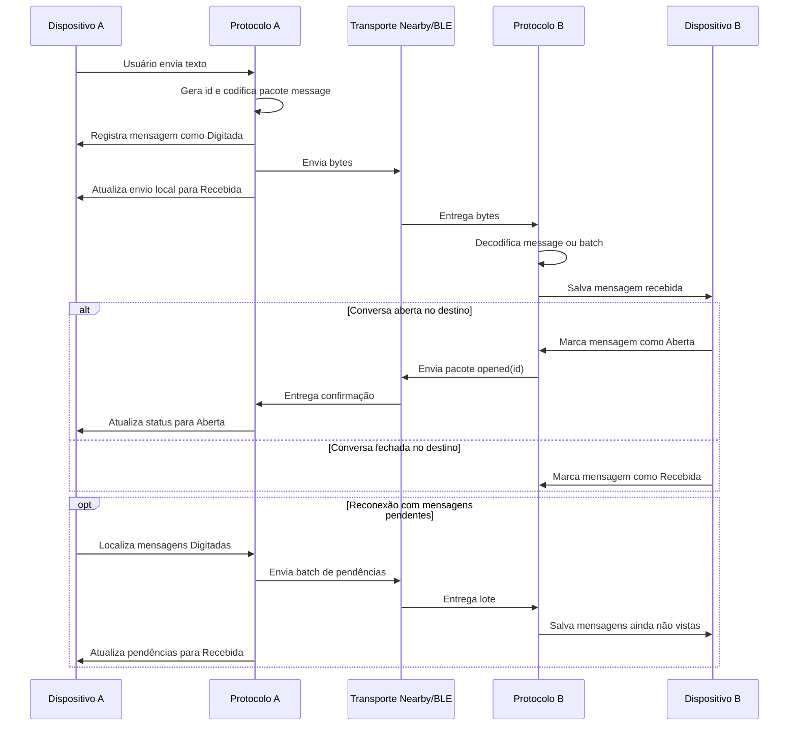

# Comunicação entre dispositivos próximos utilizando Bluetooth 

Workspace Flutter com dois aplicativos de chat local e um pacote compartilhado:

- `app/`: aplicativo Android para celular.
- `desktop/`: aplicativo Flutter desktop para notebook.
- `shared/`: pacote Dart local com o contrato comum de mensagens.

Os dois aplicativos usam o mesmo protocolo de mensagens para manter histórico, reenviar mensagens pendentes e indicar os estados `Digitada`, `Recebida` e `Aberta`.

## Estrutura

```text
connection/
|-- app/
|   |-- android/
|   |-- lib/
|   |   |-- app/
|   |   |-- core/platform/
|   |   `-- features/connection/
|   |       |-- data/
|   |       |-- models/
|   |       `-- widgets/
|   `-- test/
|-- desktop/
|   |-- lib/
|   |   `-- features/connection/
|   |       |-- data/
|   |       |-- models/
|   |       `-- widgets/
|   |-- test/
|   `-- windows/
`-- shared/
    `-- lib/
        `-- src/
```

## Pacote compartilhado

O pacote `shared/` concentra o contrato que precisa ser igual no celular e no notebook:

- `MessageStatus`: estados da mensagem.
- `MessagePacket`: pacote individual recebido ou enviado.
- `MessageProtocol`: codificação e decodificação JSON.
- `MessageBatchItem`: item usado no envio em lote.

Os apps importam esse pacote por dependência local:

```yaml
connection_shared:
  path: ../shared
```

## Comunicação

O identificador lógico da aplicação é:

```dart
br.sp.gov.cps.dsm.chat
```

Entre celulares, o app usa `nearby_connections` com a estratégia `P2P_CLUSTER`.
Essa API faz a descoberta e o transporte por recursos próximos disponíveis no Android, incluindo Bluetooth/BLE e Wi-Fi quando aplicável. Entre celular e notebook, a comunicação implementada diretamente no projeto é BLE por meio de `universal_ble`.

Para a comunicação BLE entre celular e notebook, os apps usam UUIDs derivados desse identificador:

- Service UUID BLE: `07eab2e6-fc51-5e32-a09b-788f502b8ed7`
- Característica de escrita: `6dff0753-7a8e-57d7-9858-f4f4c781cb81`
- Característica de notificação: `8bc8e5cf-54eb-59ff-a05d-f94177f07f8d`

O celular também mantém um serviço em primeiro plano para continuar disponível para localização e conversa enquanto o app não está aberto na tela.

## Permissões Android

O app Android declara permissões para descoberta de dispositivos próximos, comunicação BLE/Nearby e execução em segundo plano:

- `ACCESS_COARSE_LOCATION` e `ACCESS_FINE_LOCATION`: exigidas pelo Android para descoberta de dispositivos próximos em APIs que usam Bluetooth/BLE e Nearby.
- `BLUETOOTH` e `BLUETOOTH_ADMIN`: compatibilidade com versões antigas do Android.
- `BLUETOOTH_ADVERTISE`, `BLUETOOTH_SCAN` e `BLUETOOTH_CONNECT`: anunciar, buscar e conectar dispositivos BLE no Android 12 ou superior.
- `NEARBY_WIFI_DEVICES`: descoberta de dispositivos próximos usando recursos de Wi-Fi no Android 13 ou superior.
- `ACCESS_WIFI_STATE` e `CHANGE_WIFI_STATE`: suporte aos recursos de Wi-Fi usados por bibliotecas de proximidade.
- `POST_NOTIFICATIONS`: exibir a notificação persistente do serviço em primeiro plano no Android 13 ou superior.
- `FOREGROUND_SERVICE` e `FOREGROUND_SERVICE_CONNECTED_DEVICE`: manter um serviço de conexão ativo em primeiro plano.
- `READ_CONTACTS` e `CAMERA`: permissões declaradas para funcionalidades auxiliares do app, não para o transporte de mensagens.

Em runtime, a tela de conexão solicita localização, notificações, permissões Bluetooth e `nearbyWifiDevices`. Além de conceder as permissões, o usuário deve manter Bluetooth, Wi-Fi e localização ativados no aparelho para que a descoberta funcione de forma consistente.

## Execução em background

Quando o celular fica disponível para conexões, o app inicia `ConnectionForegroundService` por meio de um `MethodChannel` Flutter. No Android, esse serviço chama `startForeground`, usa o tipo `connectedDevice` e exibe uma notificação persistente com a mensagem de que a conexão está ativa.

Esse serviço reduz a chance de o Android interromper a disponibilidade do app quando ele sai da tela principal. Ainda assim, o comportamento pode variar conforme fabricante, modo de economia de bateria e restrições do sistema. Para testes mais estáveis, desative otimizações agressivas de bateria para o app e mantenha a notificação do serviço ativa.

## Diagrama de sequência de mensagens



## Pré-requisitos

Instale e configure o Flutter SDK. Depois confirme o ambiente:

```bash
flutter doctor
```

Para Android:

- Android Studio ou Android SDK instalado.
- Um celular Android real com depuração USB ativada.
- Bluetooth, Wi-Fi e localização ativados no celular.
- Permissões solicitadas pelo app concedidas no primeiro uso.

Para Windows desktop:

- Visual Studio 2022 Community, Professional ou Enterprise.
- Workload `Desktop development with C++`.
- Componentes de CMake e Windows SDK selecionados pelo instalador.

Sem o Visual Studio com C++, o comando `flutter run -d windows` não compila o app do notebook.

## Rodar no celular

Conecte o celular por USB e confirme que ele aparece na lista de dispositivos:

```bash
flutter devices
```

Prepare e execute o app Android:

```bash
cd app
flutter pub get
flutter run
```

Se houver mais de um dispositivo conectado, informe o id:

```bash
flutter run -d <id-do-celular>
```

O app mobile fica fixo em orientação vertical. Ao abrir, conceda as permissões solicitadas e mantenha Bluetooth, Wi-Fi e localização ligados.

## Rodar no notebook

No Windows, execute o app desktop:

```bash
cd desktop
flutter pub get
flutter run -d windows
```

Se estiver usando outro sistema com suporte Flutter desktop configurado, troque o destino:

```bash
flutter run -d linux
flutter run -d macos
```

## Fluxo de teste entre celular e notebook

1. Rode o app no celular.
2. Rode o app no notebook.
3. No notebook ou no celular, use as opções de busca para localizar celulares ou notebooks.
4. Selecione o dispositivo encontrado.
5. Envie mensagens pelo campo de chat.
6. Verifique os estados das mensagens:
   - `Digitada`: mensagem registrada localmente, ainda pendente de envio.
   - `Recebida`: mensagem entregue ao dispositivo de destino.
   - `Aberta`: conversa aberta no app de destino.

As mensagens ficam persistidas localmente. Ao reconectar com um dispositivo conhecido, mensagens pendentes podem ser reenviadas em lote.

## Comandos úteis

Formatar os três projetos:

```bash
dart format app/lib app/test desktop/lib desktop/test shared/lib
```

Analisar:

```bash
cd app && flutter analyze
cd ../desktop && flutter analyze
cd ../shared && dart analyze
```

Testar:

```bash
cd app && flutter test
cd ../desktop && flutter test
```

## Observações

- A versão Web/Chrome não é alvo deste projeto, pois a comunicação depende de APIs nativas.
- Logs de recursos indisponíveis do aparelho, como NFC, podem ser ignorados se não forem relacionados ao Bluetooth.
- Se permissões antigas ficarem presas durante testes Android, desinstale o app do celular e instale novamente.
